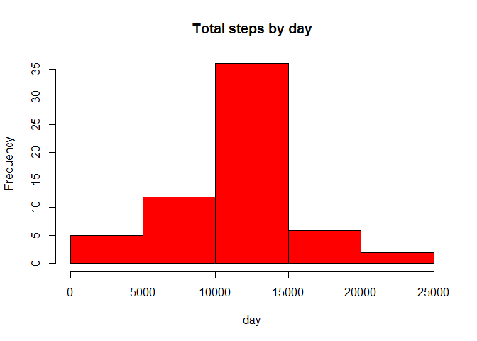

# Reproducible Research: Peer Assessment 1


```r
## Loading and preprocessing the data
unzip("activity.zip")
act=read.csv("activity.csv")
attach(act)
head(act)
```

```
##   steps       date interval
## 1    NA 2012-10-01        0
## 2    NA 2012-10-01        5
## 3    NA 2012-10-01       10
## 4    NA 2012-10-01       15
## 5    NA 2012-10-01       20
## 6    NA 2012-10-01       25
```


```r
## What is mean total number of steps taken per day?

TotalSteps= aggregate(steps ~ date, data = act, sum,na.rm=TRUE)

hist(TotalSteps$steps, main = "Total steps by day", xlab = "day", col = "red")
```

 

```r
mean(TotalSteps$steps)
```

```
## [1] 10766.19
```

```r
median(TotalSteps$steps)
```

```
## [1] 10765
```


```r
## What is the average daily activity pattern?
cact <- tapply(act$steps, act$interval, mean, na.rm = TRUE)

plot(row.names(cact), cact, type = "l", xlab = "5-min interval", 
    ylab = "Average across all Days", main = "Average number of steps taken", 
    col = "red")
```

 

```r
maxint=which.max(cact)
names(maxint)
```

```
## [1] "835"
```


```r
## Imputing missing values
actNa=sum(is.na(act))

AverageStep <- aggregate(steps ~ interval, data = act, FUN = mean)
fillNA <- numeric()

for (i in 1:nrow(act)) {
    obs <- act[i, ]
    if (is.na(obs$steps)) {
        steps <- subset(AverageStep, interval == obs$interval)$steps
    } else {
        steps <- obs$steps
    }
    fillNA <- c(fillNA, steps)
}

newact=act

newact$steps=fillNA

Total2 <- aggregate(steps ~ date, data = newact, sum, na.rm = TRUE)

hist(Total2$steps, main = "Total steps by day", xlab = "day", col = "red")
```

 

```r
mean(Total2$steps)
```

```
## [1] 10766.19
```

```r
median(Total2$steps)
```

```
## [1] 10766.19
```


```r
## Are there differences in activity patterns between weekdays and weekends?

daytype <- function(date) {
    if (weekdays(as.Date(date)) %in% c("Saturday", "Sunday")) {
        "weekend"
    } else {
        "weekday"
    }
}
act$daytype <- as.factor(sapply(act$date, daytype))

par(mfrow = c(2, 1))
for (type in c("weekend", "weekday")) {
    steps.type <- aggregate(steps ~ interval, data = act, subset = act$daytype == 
        type, FUN = mean)
    plot(steps.type, type = "l", main = type)
}
```

 


